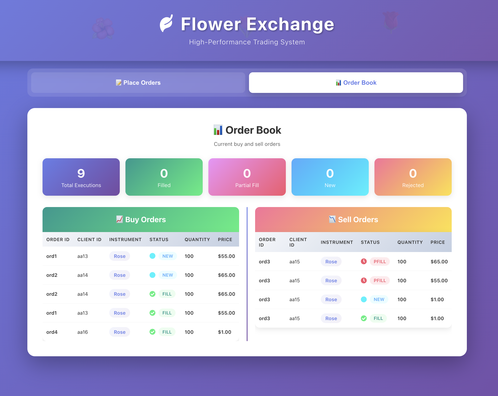

# Flower Exchange Trading System

> A high-performance trading system simulator with modern web interface, developed as the final project for the **High-Performance and Mission-Critical Software Development** workshop by **London Stock Exchange Group (LSEG)**.

[](https://isocpp.org/)
[](https://reactjs.org/)
[](https://nodejs.org/)
[](LICENSE)

## Table of Contents

- [Overview](#overview)
- [Features](#features)
- [Quick Start](#quick-start)
- [Project Structure](#project-structure)
- [Technology Stack](#technology-stack)
- [Installation](#installation)
- [Usage](#usage)
  - [Web Interface](#web-interface)
  - [Command Line](#command-line)
  - [API Integration](#api-integration)
- [How It Works](#how-it-works)
- [Performance](#performance)
- [API Reference](#api-reference)
- [Configuration](#configuration)
- [Troubleshooting](#troubleshooting)
- [Contributing](#contributing)
- [License](#license)

---

## Overview

Flower Exchange is a complete order matching engine that processes buy and sell orders for flower instruments in real-time. The system implements a **price-time priority algorithm**, comprehensive order validation, and generates detailed execution reports - all in **sub-millisecond** execution time.

### What Makes It Special?

- **Lightning Fast**: Average execution time of 492 microseconds
- **Modern UI**: Beautiful gradient-based React interface
- **Full-Stack**: C++ engine + Node.js API + React frontend
- **Real-time**: Live order book visualization
- **Production-Ready**: Complete with tests, docs, and automation

---

## ✨ Features

### Core Trading Engine
- Sub-millisecond order matching (C++)
- Price-time priority algorithm
- Comprehensive order validation
- 5 flower instruments (Rose, Lavender, Tulip, Orchid, Lotus)
- Multiple execution states (New, Fill, PFill, Rejected)
- CSV input/output support

### Web Application
- Modern gradient UI design
- Dynamic order placement form
- CSV file upload
- Live order book display
- Real-time statistics dashboard
- Fully responsive (mobile-friendly)
- Smooth animations

### Backend API
- RESTful architecture
- File upload handling
- C++ engine integration
- CSV parsing
- CORS enabled
- Error handling

---

## 🚀 Quick Start

### One-Command Startup

**macOS/Linux:**
```bash
chmod +x start.sh && ./start.sh
```

**Windows:**
```cmd
start.bat
```

That's it! The script will:
- ✅ Compile the C++ engine
- ✅ Install all dependencies
- ✅ Start backend (port 3001)
- ✅ Start frontend (port 3000)
- ✅ Open your browser

### Access Points
- **Frontend**: http://localhost:3000
- **Backend API**: http://localhost:3001/api
- **Health Check**: http://localhost:3001/api/health

---

## 📁 Project Structure

```
Flower_exchanger/
├── 🔧 Core Engine
│   ├── flower_exchange.cpp          # C++ matching engine
│   └── flower_exchange              # Compiled executable
│
├── 🖥️ Backend (Node.js + Express)
│   ├── server.js                    # REST API
│   ├── package.json                 # Dependencies
│   └── uploads/                     # File uploads
│
├── 🎨 Frontend (React)
│   ├── public/
│   │   └── index.html
│   ├── src/
│   │   ├── components/
│   │   │   ├── Header.js           # App header
│   │   │   ├── OrderForm.js        # Order input
│   │   │   └── ExecutionReport.js  # Order book view
│   │   ├── App.js                  # Main app
│   │   └── index.js                # Entry point
│   └── package.json
│
├── 📁 Test Cases
│   └── testcases/                   # 8 test scenarios
│
├── 🚀 Automation
│   ├── start.sh                     # macOS/Linux startup
│   └── start.bat                    # Windows startup
│
└── 📚 Documentation
    ├── README.md                    # This file
    └── docs/                        # Additional docs
```

---

## 🛠️ Technology Stack

| Layer | Technology | Purpose |
|-------|-----------|---------|
| **Frontend** | React 18.2 | UI Components |
| | Axios | HTTP Client |
| | React Icons | Icons |
| | CSS3 | Styling & Animations |
| **Backend** | Node.js + Express | REST API |
| | Multer | File Uploads |
| | csv-parser | CSV Processing |
| | CORS | Cross-Origin |
| **Engine** | C++11 | Order Matching |
| | STL | Data Structures |
| | Streams | File I/O |

---

## 💻 Installation

### Prerequisites

- **C++ Compiler**: g++ with C++11 support
- **Node.js**: v14 or higher
- **npm**: v6 or higher

**Check versions:**
```bash
g++ --version
node --version
npm --version
```

**Install on macOS:**
```bash
brew install gcc node
```

**Install on Ubuntu/Debian:**
```bash
sudo apt update
sudo apt install g++ nodejs npm
```

### Manual Setup

#### 1. Compile C++ Engine
```bash
g++ -std=c++11 -o flower_exchange flower_exchange.cpp
```

#### 2. Setup Backend
```bash
cd backend
npm install
npm start
```

Backend runs on `http://localhost:3001`

#### 3. Setup Frontend
```bash
cd frontend
npm install
npm start
```

Frontend opens at `http://localhost:3000`

---

## Usage

### Web Interface

1. **Navigate to** `http://localhost:3000`
2. **Place Orders Tab:**
   - Fill order details (Client ID, Instrument, Side, Quantity, Price)
   - Click "Add Another Order" for multiple orders
   - Or upload a CSV file
   - Click "Execute Orders"


3. **Order Book Tab:**
   - View buy orders (left side)
   - View sell orders (right side)
   - See execution statistics



### Command Line

1. **Create input file** `temp_orders.csv`:
```csv
Client Order ID,Instrument,Side,Quantity,Price
aa13,Rose,1,100,55
aa14,Rose,2,50,54
```

2. **Run engine:**
```bash
./flower_exchange
```

3. **Check output** `Execution_Rep.csv`

### API Integration

**Submit orders via API:**
```bash
curl -X POST http://localhost:3001/api/orders \
  -H "Content-Type: application/json" \
  -d '{
    "orders": [{
      "clientOrderId": "aa1",
      "instrument": "Rose",
      "side": "1",
      "quantity": "100",
      "price": "50"
    }]
  }'
```

**Upload CSV file:**
```bash
curl -X POST http://localhost:3001/api/upload \
  -F "file=@orders.csv"
```

---

## 🔍 How It Works

### Order Matching Algorithm

The system uses **price-time priority** matching:

1. **Buy Orders**: Sorted by price (highest first), then time
2. **Sell Orders**: Sorted by price (lowest first), then time
3. **Matching**: Orders matched when price conditions met
4. **Execution**: Filled at resting order price

### Order Book Structure

Each instrument maintains separate order books:
- **Buy orders** with price ≥ best sell → matched immediately
- **Sell orders** with price ≤ best buy → matched immediately
- **Unmatched portions** → remain as "New" orders

### Validation Rules

| Field | Rule |
|-------|------|
| Client Order ID | Not empty |
| Instrument | Rose, Lavender, Tulip, Orchid, or Lotus |
| Side | 1 (Buy) or 2 (Sell) |
| Quantity | Multiple of 10, between 10-999 |
| Price | ≥ 0 |

### Execution States

- **New**: Order in book, awaiting match
- **Fill**: Fully executed
- **PFill**: Partially filled
- **Rejected**: Validation failed

---

## ⚡ Performance

### Benchmark Results

| Metric | Value |
|--------|-------|
| Average Execution | 492 μs |
| Fastest | 286 μs |
| Slowest | 703 μs |
| Throughput | 2,000+ orders/sec |

### Test Cases (All Passing ✅)

| Test | Description | Time | Status |
|------|-------------|------|--------|
| Orders.csv | Single sell order | 410 μs | ✅ |
| Orders2.csv | No matching | 318 μs | ✅ |
| Orders3.csv | Exact match | 578 μs | ✅ |
| Orders4.csv | Partial fill | 703 μs | ✅ |
| Orders5.csv | Multiple buys vs sell | 286 μs | ✅ |
| Orders6.csv | Complete matching | 680 μs | ✅ |
| Orders7.csv | Validation tests | 445 μs | ✅ |
| test.csv | Multiple partials | 520 μs | ✅ |

---

## 📡 API Reference

### Base URL
```
http://localhost:3001/api
```

### Endpoints

#### 1. Health Check
```http
GET /health
```

**Response:**
```json
{
  "status": "ok",
  "message": "Flower Exchange Backend is running"
}
```

#### 2. Submit Orders
```http
POST /orders
Content-Type: application/json
```

**Request:**
```json
{
  "orders": [
    {
      "clientOrderId": "aa13",
      "instrument": "Rose",
      "side": "1",
      "quantity": "100",
      "price": "55"
    }
  ]
}
```

**Response:**
```json
{
  "success": true,
  "message": "Orders processed successfully",
  "executionReport": [...]
}
```

#### 3. Upload CSV
```http
POST /upload
Content-Type: multipart/form-data
```

**Form Data:**
- Field: `file`
- Type: CSV file

#### 4. Get Execution Report
```http
GET /execution-report
```

---

## ⚙️ Configuration

### Change Input File (CLI Mode)

Edit `flower_exchange.cpp` line 11:
```cpp
ifstream ifile("your_file.csv");
```

### Change Ports

**Backend** - Create `backend/.env`:
```env
PORT=3001
```

**Frontend** - Create `frontend/.env`:
```env
PORT=3000
```

### Enable Debugging

**C++**: Uncomment debug prints in `flower_exchange.cpp`
```cpp
// Lines 188-191, 199-202
cout << "Processing Order..." << endl;
```

---

## 🔧 Troubleshooting

### Common Issues

**Port Already in Use**
```bash
# macOS/Linux
kill -9 $(lsof -ti:3001)  # Backend
kill -9 $(lsof -ti:3000)  # Frontend

# Windows
netstat -ano | findstr :3001
taskkill /PID <PID> /F
```

**Module Not Found**
```bash
cd backend && npm install
cd frontend && npm install
```

**C++ Compilation Error**
```bash
# Ensure g++ is installed
g++ --version

# Recompile
g++ -std=c++11 -o flower_exchange flower_exchange.cpp
```

**CORS Error**
- Verify backend is running on port 3001
- Check browser console for details

**Orders Not Executing**
- Ensure `flower_exchange` executable exists
- Check `temp_orders.csv` can be created
- Verify backend logs for errors

### Getting Help

1. Check error messages in console
2. Review backend terminal output
3. Verify all dependencies installed
4. Ensure correct Node.js/npm versions
5. Check file permissions (Unix/Linux)

---

## 🎨 Design System

### Color Palette
- **Primary**: `#667eea` (Purple)
- **Secondary**: `#764ba2` (Deep Purple)
- **Success**: `#38ef7d` (Green)
- **Warning**: `#f5576c` (Pink)
- **Info**: `#00f2fe` (Cyan)

### Gradients
- **Header**: `linear-gradient(135deg, #667eea 0%, #764ba2 100%)`
- **Buy Header**: `linear-gradient(135deg, #11998e 0%, #38ef7d 100%)`
- **Sell Header**: `linear-gradient(135deg, #fa709a 0%, #fee140 100%)`

### Responsive Breakpoints
- Desktop: 1200px+
- Tablet: 768px - 1199px
- Mobile: < 768px

---

## 🚀 Deployment

### Production Build

**Frontend:**
```bash
cd frontend
npm run build
```

Output in `frontend/build/`

**Backend with PM2:**
```bash
npm install -g pm2
cd backend
pm2 start server.js --name flower-exchange
pm2 save
pm2 startup
```

### Docker (Optional)

```dockerfile
FROM node:14
WORKDIR /app

# Install g++
RUN apt-get update && apt-get install -y g++

# Copy and compile C++
COPY flower_exchange.cpp ./
RUN g++ -std=c++11 -o flower_exchange flower_exchange.cpp

# Install backend
COPY backend/package*.json ./backend/
RUN cd backend && npm install

# Copy frontend build
COPY frontend/build ./frontend/build

EXPOSE 3001
CMD ["node", "backend/server.js"]
```

---

## 🎓 Learning Outcomes

This project demonstrates:
- ✅ Order matching engine fundamentals
- ✅ C++ performance optimization
- ✅ Financial market microstructure
- ✅ Full-stack web development
- ✅ RESTful API design
- ✅ React component architecture
- ✅ File upload/processing
- ✅ Real-time data visualization
- ✅ Algorithm complexity optimization

---

## 🔮 Future Enhancements

- [ ] WebSocket real-time updates
- [ ] Database persistence (MongoDB/PostgreSQL)
- [ ] User authentication
- [ ] Order cancellation/modification
- [ ] Advanced order types (FOK, IOC)
- [ ] Market orders
- [ ] Price charts
- [ ] Dark mode
- [ ] Mobile app
- [ ] Export to PDF/Excel
- [ ] Analytics dashboard

---

## Changelog

### Version 2.0.0 (Current)
- Full-stack web application
- Modern React frontend
- Node.js REST API
- Order book visualization
- Automated setup scripts
- Comprehensive documentation

### Version 1.0.0
- C++ matching engine
- CLI interface
- 8 test cases
- Basic documentation

---

## 👨‍💻 Author

**Prabath Wijethilaka**  
Developed as part of LSEG High-Performance Software Development Workshop

- GitHub: [@PrabathBK](https://github.com/PrabathBK)
- Project: Flower Exchange Trading System

---

## 🙏 Acknowledgments

- **London Stock Exchange Group (LSEG)** for the workshop
- **High-Performance Software Development** course instructors
- Open-source community for amazing tools

---

## 📄 License

This project was created for **educational purposes** as part of the LSEG workshop.

---

## Support

If you found this project helpful, please consider:
- Starring the repository
- Forking for your own experiments
- Sharing with others
- Reporting issues
- Suggesting improvements

---

<div align="center">

**Built with quality and performance in mind**

Flower Exchange Trading System

</div>
